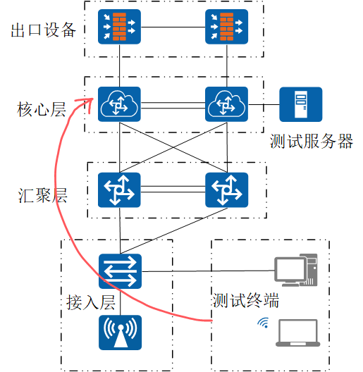
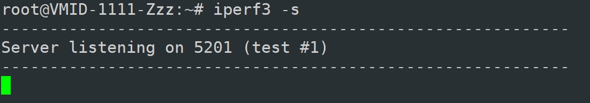
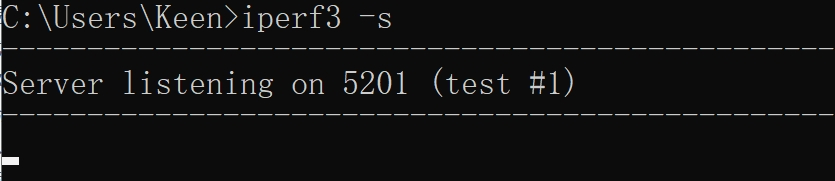
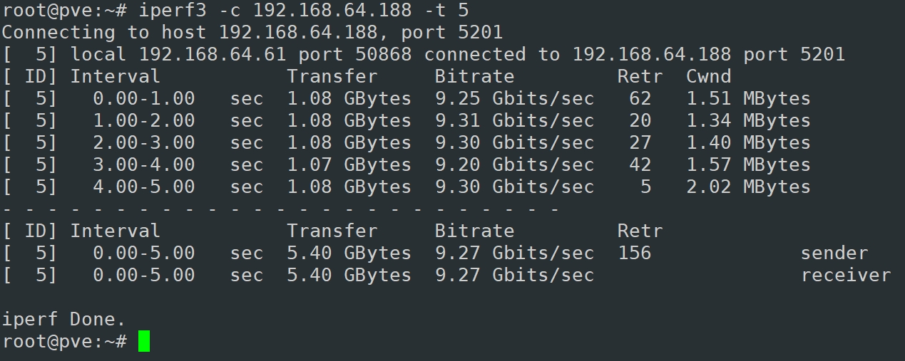
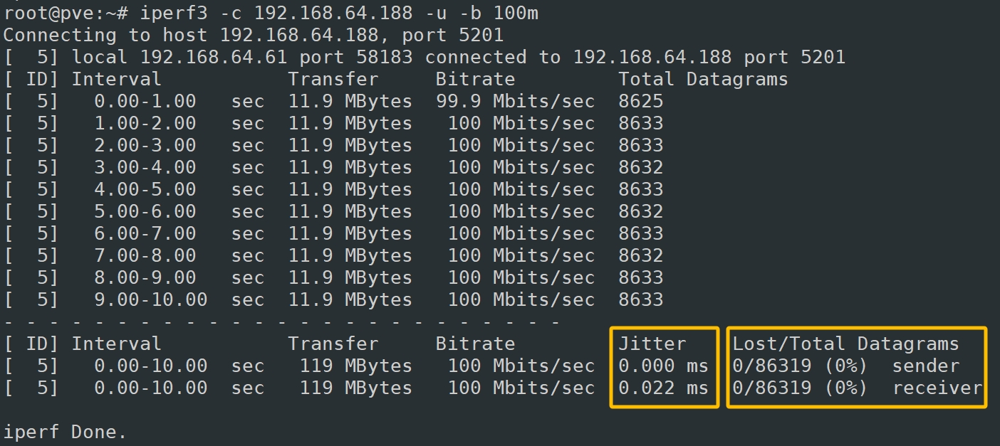
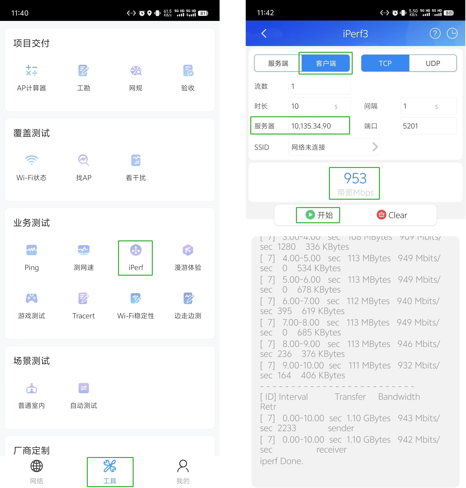
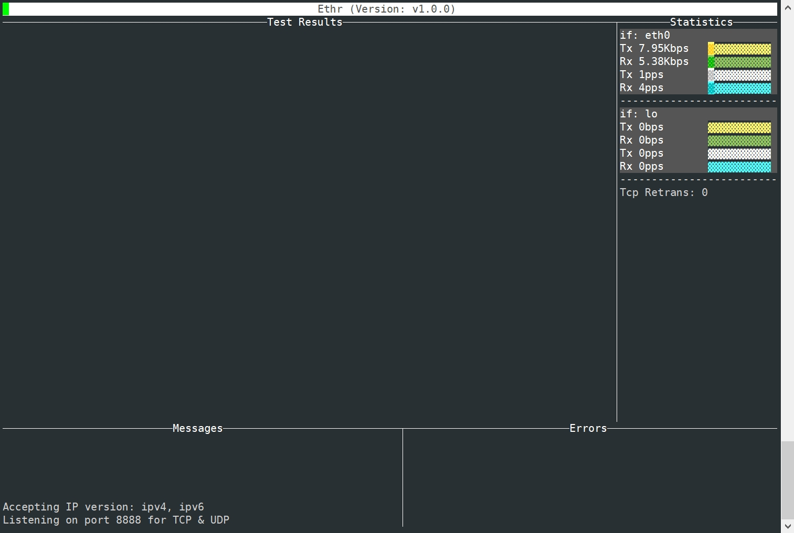
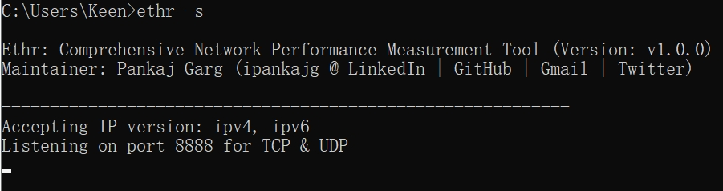
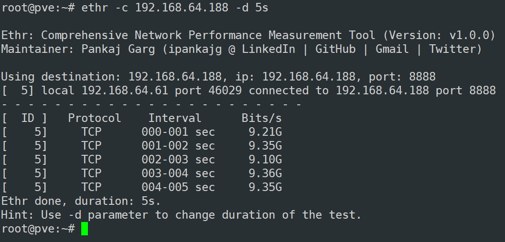
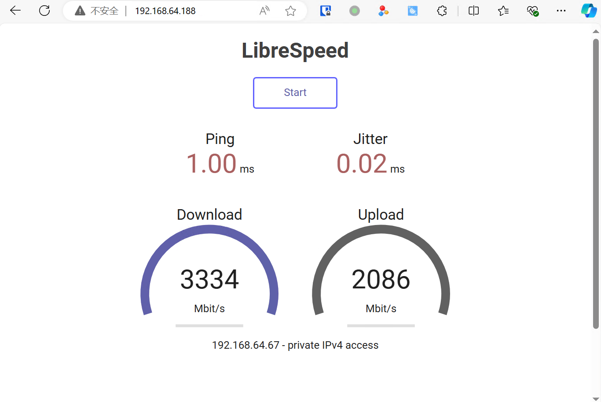

# 关于网络性能测试的一些方法 & 工具
> ✍️ 2024-07-18 | 陈文杰


## 一、 意义
测试网络性能

## 二、 网络性能指标
- 带宽（Bandwidth）
   - **定义**：网络连接在单位时间内能够传输的最大数据量，通常以每秒兆比特（Mbps）或每秒千兆比特（Gbps）来表示。
   - **正常范围**：取决于网络类型和需求。例如，家庭宽带通常为100 Mbps到1 Gbps；企业网络可能为100 Mbps到10 Gbps或更高。

- 吞吐量（throughput）
   - **定义**：实际在单位时间内传输的数据量，通常以每秒兆比特（Mbps）来表示。
   - **正常范围**：理想情况下接近带宽，但由于网络开销和其他因素，实际吞吐量通常比带宽低。

- 延迟（Latency）
   - **定义**：数据包从源端到达目的端所需的时间，通常以毫秒（ms）为单位。
   - **正常范围**：局域网（LAN）通常在1 ms到5 ms之间；广域网（WAN）可能在10 ms到100 ms或更高。

- 抖动（Jitter）
   - **定义**：数据包传输延迟的变异性，通常以毫秒（ms）为单位。
   - **正常范围**：对于语音和视频应用，抖动应尽量低，一般在30 ms以内较为理想。

- 丢包率（Pocket Lost Rate）
   - **定义**：在数据传输过程中丢失的数据包占总数据包的比例，通常以百分比表示。
   - **正常范围**：理想情况下应接近0%。对于大多数应用，丢包率应低于1%；对于实时应用如视频会议，丢包率应低于0.1%。

## 三、 环境准备
### 确定测试目标
如下图网络环境，需测试**接入层**至**核心层**的有线无线网络性能，则需将服务器放置在**核心层**。



### 测试设备
如测试10G网络，确保服务器及测试终端拥有足够处理性能，同时具备10G网络接入能力，尽量使用Linux系统进行测试；无线测试终端确保拥有高性能无线网卡，以尽可能消除测试终端的性能瓶颈。

### 测试时间
选择网络流量低峰期测试，以减少外界干扰

## 四、 测试工具
### 1. iPerf3 (C/S)
>*iPerf及微软官方均不建议在Windows环境下使用iPerf3，测试性能可能会降低，具体原因可浏览以下文章：[不应该在 Windows 上使用 iPerf3 的三个原因](https://techcommunity.microsoft.com/t5/networking-blog/three-reasons-why-you-should-not-use-iperf3-on-windows/ba-p/4117876)*
______
#### 服务端
**Linux**
- 根据不同Linux系统，安装iPerf3
```bash
dnf install iperf3 -y          ### 用于 RedHat/CentOS/openEuler
apt-get install iperf3 -y      ### 用于 Debian/Ubuntu
```
- 运行iPerf3服务端
``` bash
iperf3 -h         ### 查看帮助
iperf3 -s         ### 以服务端模式运行
iperf3 -s -D      ### 以服务端模式运行并开启进程守护
```
如下图所示，iPerf3服务端以运行并默认监听5201端口



**Windows** *（官方不建议）*

- 从`https://files.budman.pw/`下载iPerf3
- 将压缩包内的exe及dll文件解压并复制到目录`C:\Windows\System32`
- 运行iPerf3服务端

打开 *CMD/PowerShell:*
```bash
iperf3 -h         ### 查看帮助
iperf3 -s         ### 以服务端模式运行
iperf3 -s -D      ### 以服务端模式运行并开启进程守护
```
如下图所示，iPerf3服务端以运行并默认监听5201端口



______
#### 客户端
**Linux / Windows**
- 安装iPerf3：客户端与服务端为相同程序，安装方法参考服务端
- 使用iPerf3，（Windows通过*CMD/PowerShell*）

以下列举几个常用的性能指标测试，可根据实际情况使用具体参数，参数说明通过`iperf3 -h`命令查看。

**吞吐量测试**
```bash
iperf3 -c <Server_IP>         ### 基本TCP吞吐量测试
```
```bash
iperf3 -c <Server_IP> -t 30 -f m  ### 指定测试持续时间为 30 秒，单位为Mbits/s
```
下图为TCP吞吐量测试结果，输出结果中包含多项参数指标：



   - Interval：表示测试的时间段，从 0 到 5 秒，默认每隔 1 秒汇报一次结果;
   - Transfer：表示在单位时间内传输的数据总量;
   - Bitrate：表示在单位时间内的平均传输速率，单位可以是 Kbits/sec、Mbits/sec 或 Gbits/sec，可通过 `-f` 参数指定单位;
   - Retr：表示在测试过程中 TCP 数据包重传的次数,重传次数越多，可能表明网络质量较差;
   - Cwnd：表示 TCP 拥塞窗口的大小，反映了 TCP 连接的流量控制情况。

**网络抖动、丢包率测试**

>实时应用（如视频会议、VoIP、直播等）通常使用 UDP，因为这些应用更关心网络**抖动**和**丢包**，而不需要数据包重传。因此，使用 **UDP 模式**可以更真实地模拟这些应用的网络行为，而 TCP 模式主要关注吞吐量和连接的可靠性。
```bash
iperf3 -c <Server_IP> -u -b 100M      ### UDP模式测试，指定目标带宽为 100 Mbps
```
下图为UDP抖动、丢包率测试结果，输出结果中包含多项参数指标：



   - Interval：表示测试的时间段，从 0 到 5 秒，默认每隔 1 秒汇报一次结果;
   - Transfer：表示在单位时间内传输的数据总量;
   - Bitrate：表示在单位时间内的平均传输速率，单位可以是 Kbits/sec、Mbits/sec 或 Gbits/sec，可通过 `-f` 参数指定单位;
   - Total Datagrams：表示在单位时间内传输的数据包总量;
   - **Jitter**：表示网络延迟的变化情况;抖动值越小，网络延迟越稳定;
   - **Lost/Total Datagrams**：表示测试过程中的丢包率。

**移动端**
- Android系统使用华为`CloudCamups APP`



- iOS系统自行寻找兼容iPerf3的APP

____
### 2. ethr (C/S)
#### 服务端
**Linux**
- 安装ethr
```bash
wget https://github.com/microsoft/ethr/releases/latest/download/ethr_linux.zip      ### 下载软件包
unzip ethr_linux.zip             ### 解压软件包
cp ./ethr /usr/local/bin         ### 复制ethr至系统可执行文件目录/usr/local/bin
```
- 运行ethr服务端
```bash
ethr -h           ### 查看帮助
ethr -s -ui       ### 以服务端模式运行ethr，并开启ui界面
```
如下图所示，ethr服务端以运行并默认监听8888端口



**Windows**
- 从`https://github.com/microsoft/ethr/releases/latest/download/ethr_windows.zip`下载软件包
- 将压缩包内的exe文件解压并复制到目录`C:\Windows\System32`
- 运行ethr服务端

打开 *CMD/PowerShell:*
```bash
ethr -h           ### 查看帮助
ethr -s           ### 以服务端模式运行ethr
```
如下图所示，ethr服务端以运行并默认监听8888端口



#### 客户端
**Linux / Windows**
- 安装ethr：方法与服务端相同
- 吞吐量测试，（Windows通过*CMD/PowerShell*）

```bash
ethr -c <Server_IP> -d 5s        ### 测试TCP吞吐量，维持时间5秒
```
下图为TCP吞吐量测试结果，输出结果中包含多项参数指标：



   - Protocol：测试协议，默认为TCP，可通过`-p`参数指定
   - Interval：表示测试的时间段，从 0 到 5 秒，默认每隔 1 秒汇报一次结果
   - Bits/s：表示在单位时间内的平均传输速率

### 3. Speedtest (B/S)
相比iPerf、ethr，Speedtest提供Web测速界面，对客户端提供更直观、便捷的测速体验。
#### 服务端
以下为**Linux**系统下通过Docker容器运行Speedtest
- 安装Docker环境
```bash
sudo bash <(curl -sSL https://linuxmirrors.cn/docker.sh)      ### Docker 一键安装脚本
sudo docker -v      ### 查看Docker版本
```
- 运行Speedtest
```bash
sudo docker pull ghcr.io/librespeed/speedtest:latest     ### 拉取Speedtest镜像
sudo docker run -d --name=speedtest -p 80:80 ghcr.io/librespeed/speedtest:latest    ### 运行Speedtest容器，监听80端口 
```

#### 客户端
**PC端/移动端**
- 打开浏览器，建议使用Chrome/Edge等主流高性能浏览器
- 访问http://<Server_ip>:80
- 开始测速



### 个人建议
万兆网络测试建议服务端和客户端均使用**Linux**系统，经过反复测试，相同环境下，**Windows**在上述3个工具的测试结果均只达到**3G+bps/s**，**Linux**则均能接近**10Gbps/s**。实验不完全严谨，结论仅供参考。

### 参考链接
><a href="https://software.es.net/iperf/">iPerf3 官网</a>

><a href="https://github.com/microsoft/ethr">ethr</a>

><a href="https://github.com/librespeed/speedtest">Speedtest</a>